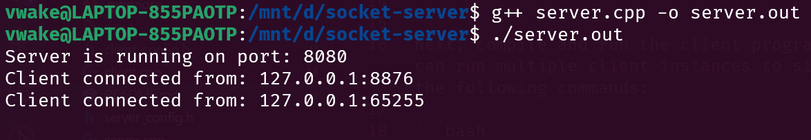
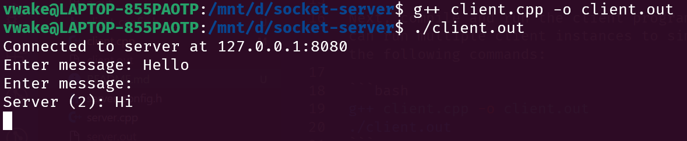

# Simple Chat Server using C++

This is an implementation of a chat server and client system on a Linux machine, utilizing the `sys/socket.h` socket library in C++.

The code consists of two programs: one for the server and one for the client. The server binds to the local IPv4 address, `127.0.0.1`, and port `8080` by default. However, you can configure the server to bind to any other local IP address and port by modifying the `./server_config.h` file. Be sure to update the `./client_config.h` file accordingly to reflect the changes in the IP address and port. By default, both files are set to `127.0.0.1:8080`.

## Code Execution

To start the server, compile and run the server program using the following commands:

```bash
g++ server.cpp -o server.out
./server.out
```

Next, compile and run the client program in separate terminal windows (you can run multiple client instances to simulate multiple connections) using the following commands:

```bash
g++ client.cpp -o client.out
./client.out
```

## Output


_Fig 1: Output in the Server Terminal_


_Fig 2: Output in the Client Terminal_
